```mermaid
graph TB
    %% External Services Layer
    subgraph "External Services & Network"
        subgraph "Network Components"
            IGW[Internet Gateway]
            PS[Public Subnets<br/>AZ-A, AZ-B, AZ-C]
            NAT[NAT Gateway]
            PRS[Private Subnets<br/>AZ-A, AZ-B, AZ-C]
        end
        
        subgraph "External Services"
            GIT[Git Repository]
            LE[Let's Encrypt]
            AWS_EC2[AWS EC2 API]
            AWS_ALB[AWS Load Balancer]
            AWS_S3[AWS S3 State]
            AWS_DDB[AWS DynamoDB Lock]
        end
    end

    %% EKS Control Plane Layer
    subgraph "EKS Control Plane"
        CP[API Server<br/>Multi-AZ]
        ETCD[etcd Cluster<br/>Multi-AZ]
        CM[Controller Manager]
        SCHED[Scheduler]
        DNS[DNS Controller]
    end

    %% Service Layer
    subgraph "Service Layer"
        subgraph "Security & Access"
            RBAC[RBAC<br/>Access Control]
            IAM[IAM Roles<br/>AWS Permissions]
            SEC_GROUPS[Security Groups<br/>Network Security]
            NET_POLICY[Network Policies<br/>Pod Communication]
        end
        
        subgraph "Monitoring & Observability"
            PROM[Prometheus<br/>Metrics]
            GRAF[Grafana<br/>Dashboards]
            ALERTS[Alert Manager<br/>Alerts]
            LOGS[Log Aggregation<br/>Fluent Bit]
        end
    end

    %% Application Layer
    subgraph "Application Layer"
        subgraph "GitOps & CI/CD"
            ARGOCD[Argo CD<br/>GitOps Controller]
            ARGOCD_UI[Argo CD Server<br/>Web UI & API]
            ARGOCD_REPO[Argo CD Repo<br/>Git Sync]
        end
        
        subgraph "Load Balancing & SSL"
            NGINX[Nginx Ingress<br/>Controller]
            NGINX_PODS[Nginx Pods<br/>Multi-AZ]
            CERT_MGR[Cert Manager<br/>SSL Certificates]
        end
        
        subgraph "Auto-scaling"
            KARPENTER[Karpenter<br/>Node Provisioning]
            NODEPOOL[Node Pool<br/>Requirements]
            HPA[Horizontal Pod<br/>Autoscaler]
            VPA[Vertical Pod<br/>Autoscaler]
        end
        
        subgraph "Storage & Networking"
            EBS_CSI[EBS CSI Driver<br/>Block Storage]
            EFS_CSI[EFS CSI Driver<br/>File Storage]
            VPC_CNI[AWS VPC CNI<br/>Networking]
        end
        
        subgraph "Applications"
            APP_SVC[Application<br/>Services]
            APP_PODS[Application<br/>Pods]
            APP_INGRESS[Application<br/>Ingress]
        end
    end

    %% Kubernetes System Layer
    subgraph "Kubernetes System"
        WN[Worker Nodes<br/>Multi-AZ]
        KUBELET[kubelet<br/>Node Agent]
        KUBEPROXY[kube-proxy<br/>Network Proxy]
    end

    %% Key Connections
    %% Network Flow
    IGW --> PS
    PS --> NAT
    NAT --> PRS
    
    %% External to EKS
    GIT --> ARGOCD_REPO
    LE --> CERT_MGR
    AWS_EC2 --> KARPENTER
    AWS_ALB --> NGINX
    AWS_S3 --> EBS_CSI
    AWS_DDB --> EBS_CSI
    
    %% EKS Control Plane
    CP --> WN
    ETCD --> CP
    CM --> CP
    SCHED --> CP
    DNS --> CP
    
    %% Service Layer Connections
    RBAC --> ARGOCD
    RBAC --> KARPENTER
    RBAC --> CERT_MGR
    IAM --> KARPENTER
    IAM --> EBS_CSI
    IAM --> EFS_CSI
    SEC_GROUPS --> WN
    NET_POLICY --> APP_PODS
    
    %% Monitoring Connections
    PROM --> WN
    PROM --> APP_PODS
    GRAF --> PROM
    ALERTS --> PROM
    LOGS --> WN
    
    %% Application Layer Connections
    ARGOCD_REPO --> ARGOCD
    ARGOCD --> ARGOCD_UI
    ARGOCD --> APP_PODS
    
    NGINX --> NGINX_PODS
    NGINX_PODS --> APP_PODS
    CERT_MGR --> NGINX_PODS
    CERT_MGR --> APP_INGRESS
    
    KARPENTER --> NODEPOOL
    KARPENTER --> WN
    HPA --> APP_PODS
    VPA --> APP_PODS
    
    EBS_CSI --> APP_PODS
    EFS_CSI --> APP_PODS
    VPC_CNI --> WN
    
    APP_INGRESS --> NGINX
    APP_SVC --> APP_PODS
    
    %% Worker Node Components
    WN --> KUBELET
    WN --> KUBEPROXY
    WN --> VPC_CNI

    %% Styling
    classDef network fill:#FF9900,stroke:#232F3E,stroke-width:2px,color:#fff
    classDef external fill:#607D8B,stroke:#232F3E,stroke-width:2px,color:#fff
    classDef eks fill:#326CE5,stroke:#232F3E,stroke-width:2px,color:#fff
    classDef security fill:#F44336,stroke:#232F3E,stroke-width:2px,color:#fff
    classDef monitoring fill:#9C27B0,stroke:#232F3E,stroke-width:2px,color:#fff
    classDef argocd fill:#326CE5,stroke:#232F3E,stroke-width:2px,color:#fff
    classDef nginx fill:#009639,stroke:#232F3E,stroke-width:2px,color:#fff
    classDef karpenter fill:#FF6B35,stroke:#232F3E,stroke-width:2px,color:#fff
    classDef certmanager fill:#FFD700,stroke:#232F3E,stroke-width:2px,color:#000
    classDef storage fill:#4CAF50,stroke:#232F3E,stroke-width:2px,color:#fff
    classDef app fill:#4CAF50,stroke:#232F3E,stroke-width:2px,color:#fff
    classDef k8s fill:#326CE5,stroke:#232F3E,stroke-width:2px,color:#fff

    class IGW,PS,NAT,PRS network
    class GIT,LE,AWS_EC2,AWS_ALB,AWS_S3,AWS_DDB external
    class CP,ETCD,CM,SCHED,DNS eks
    class RBAC,IAM,SEC_GROUPS,NET_POLICY security
    class PROM,GRAF,ALERTS,LOGS monitoring
    class ARGOCD,ARGOCD_UI,ARGOCD_REPO argocd
    class NGINX,NGINX_PODS nginx
    class KARPENTER,NODEPOOL,HPA,VPA karpenter
    class CERT_MGR certmanager
    class EBS_CSI,EFS_CSI,VPC_CNI storage
    class APP_SVC,APP_PODS,APP_INGRESS app
    class WN,KUBELET,KUBEPROXY k8s
```

# EKS Infrastructure Architecture

## 🏗️ Complete Infrastructure Overview



## 🏗️ Detailed Architecture Overview

This document provides a comprehensive technical overview of the EKS cluster architecture, including component interactions, network topology, and design decisions.

## 📊 Infrastructure Components Architecture

### 1. Amazon EKS Cluster Architecture

```
┌─────────────────────────────────────────────────────────────────────────────┐
│                              EKS Control Plane                              │
├─────────────────────────────────────────────────────────────────────────────┤
│  ┌─────────────────┐  ┌─────────────────┐  ┌─────────────────┐              │
│  │   API Server    │  │   etcd Cluster  │  │   Controller    │              │
│  │   (Multi-AZ)    │  │   (Multi-AZ)    │  │   Manager       │              │
│  └─────────────────┘  └─────────────────┘  └─────────────────┘              │
│  ┌─────────────────┐  ┌─────────────────┐  ┌─────────────────┐              │
│  │   Scheduler     │  │   Cloud         │  │   DNS           │              │
│  │                 │  │   Controller    │  │   Controller    │              │
│  └─────────────────┘  └─────────────────┘  └─────────────────┘              │
└─────────────────────────────────────────────────────────────────────────────┘
                                    │
                                    │ API Communication
                                    ▼
┌─────────────────────────────────────────────────────────────────────────────┐
│                            Worker Node Groups                               │
├─────────────────────────────────────────────────────────────────────────────┤
│  ┌─────────────────┐  ┌─────────────────┐  ┌─────────────────┐              │
│  │   Worker Node   │  │   Worker Node   │  │   Worker Node   │              │
│  │   (AZ A)        │  │   (AZ B)        │  │   (AZ C)        │              │
│  │                 │  │                 │  │                 │              │
│  │ ┌─────────────┐ │  │ ┌─────────────┐ │  │ ┌─────────────┐ │              │
│  │ │   kubelet   │ │  │ │   kubelet   │ │  │ │   kubelet   │ │              │
│  │ │             │ │  │ │             │ │  │ │             │ │              │
│  │ └─────────────┘ │  │ └─────────────┘ │  │ └─────────────┘ │              │
│  │ ┌─────────────┐ │  │ ┌─────────────┐ │  │ ┌─────────────┐ │              │
│  │ │   kube-proxy│ │  │ │   kube-proxy│ │  │ │   kube-proxy│ │              │
│  │ │             │ │  │ │             │ │  │ │             │ │              │
│  │ └─────────────┘ │  │ └─────────────┘ │  │ └─────────────┘ │              │
│  │ ┌─────────────┐ │  │ ┌─────────────┐ │  │ ┌─────────────┐ │              │
│  │ │   CNI       │ │  │ │   CNI       │ │  │ │   CNI       │ │              │
│  │ │   Plugin    │ │  │ │   Plugin    │ │  │ │   Plugin    │ │              │
│  │ └─────────────┘ │  │ └─────────────┘ │  │ └─────────────┘ │              │
│  └─────────────────┘  └─────────────────┘  └─────────────────┘              │
└─────────────────────────────────────────────────────────────────────────────┘
```

#### Control Plane Components

- **API Server**: Handles all API requests and authentication
- **etcd**: Distributed key-value store for cluster state
- **Controller Manager**: Manages cluster-level controllers
- **Scheduler**: Assigns pods to nodes based on policies
- **Cloud Controller**: Integrates with AWS services
- **DNS Controller**: Manages CoreDNS for service discovery

#### Worker Node Components

- **kubelet**: Primary node agent for pod lifecycle management
- **kube-proxy**: Network proxy for service communication
- **CNI Plugin**: AWS VPC CNI for pod networking

### 2. Network Architecture

```
┌─────────────────────────────────────────────────────────────────────────────┐
│                                 VPC (10.0.0.0/16)                          │
├─────────────────────────────────────────────────────────────────────────────┤
│                                                                             │
│  ┌─────────────────────────────────────────────────────────────────────┐   │
│  │                        Public Subnets                              │   │
│  │  ┌─────────────┐  ┌─────────────┐  ┌─────────────┐                  │   │
│  │  │   AZ A      │  │   AZ B      │  │   AZ C      │                  │   │
│  │  │ 10.0.1.0/24 │  │ 10.0.2.0/24 │  │ 10.0.3.0/24 │                  │   │
│  │  │             │  │             │  │             │                  │   │
│  │  │ ┌─────────┐ │  │ ┌─────────┐ │  │ ┌─────────┐ │                  │   │
│  │  │ │ NAT GW  │ │  │ │ NAT GW  │ │  │ │ NAT GW  │ │                  │   │
│  │  │ │         │ │  │ │         │ │  │ │         │ │                  │   │
│  │  │ └─────────┘ │  │ └─────────┘ │  │ └─────────┘ │                  │   │
│  │  └─────────────┘  └─────────────┘  └─────────────┘                  │   │
│  └─────────────────────────────────────────────────────────────────────┘   │
│                                                                             │
│  ┌─────────────────────────────────────────────────────────────────────┐   │
│  │                       Private Subnets                              │   │
│  │  ┌─────────────┐  ┌─────────────┐  ┌─────────────┐                  │   │
│  │  │   AZ A      │  │   AZ B      │  │   AZ C      │                  │   │
│  │  │10.0.11.0/24 │  │10.0.12.0/24 │  │10.0.13.0/24 │                  │   │
│  │  │             │  │             │  │             │                  │   │
│  │  │ ┌─────────┐ │  │ ┌─────────┐ │  │ ┌─────────┐ │                  │   │
│  │  │ │ EKS     │ │  │ │ EKS     │ │  │ │ EKS     │ │                  │   │
│  │  │ │ Worker  │ │  │ │ Worker  │ │  │ │ Worker  │ │                  │   │
│  │  │ │ Nodes   │ │  │ │ Nodes   │ │  │ │ Nodes   │ │                  │   │
│  │  │ └─────────┘ │  │ └─────────┘ │  │ └─────────┘ │                  │   │
│  │  └─────────────┘  └─────────────┘  └─────────────┘                  │   │
│  └─────────────────────────────────────────────────────────────────────┘   │
│                                                                             │
│  ┌─────────────────────────────────────────────────────────────────────┐   │
│  │                      Database Subnets                               │   │
│  │  ┌─────────────┐  ┌─────────────┐  ┌─────────────┐                  │   │
│  │  │   AZ A      │  │   AZ B      │  │   AZ C      │                  │   │
│  │  │10.0.21.0/24 │  │10.0.22.0/24 │  │10.0.23.0/24 │                  │   │
│  │  └─────────────┘  └─────────────┘  └─────────────┘                  │   │
│  └─────────────────────────────────────────────────────────────────────┘   │
└─────────────────────────────────────────────────────────────────────────────┘
```

#### Network Components

- **VPC**: Isolated network environment (10.0.0.0/16)
- **Public Subnets**: Internet-facing subnets with NAT Gateways
- **Private Subnets**: Worker nodes and internal services
- **Database Subnets**: Isolated subnets for RDS and other databases
- **Route Tables**: Control traffic flow between subnets

### 3. Argo CD Architecture

```
┌─────────────────────────────────────────────────────────────────────────────┐
│                              Argo CD Architecture                           │
├─────────────────────────────────────────────────────────────────────────────┤
│                                                                             │
│  ┌─────────────────┐  ┌─────────────────┐  ┌─────────────────┐              │
│  │   Argo CD       │  │   Argo CD       │  │   Argo CD       │              │
│  │   Server        │  │   Repo Server   │  │   Controller    │              │
│  │                 │  │                 │  │                 │              │
│  │ ┌─────────────┐ │  │ ┌─────────────┐ │  │ ┌─────────────┐ │              │
│  │ │   Web UI    │ │  │ │   Git       │ │  │ │ Application │ │              │
│  │ │   & API     │ │  │ │ Repository  │ │  │ │ Controller  │ │              │
│  │ │             │ │  │ │   Sync      │ │  │ │             │ │              │
│  │ └─────────────┘ │  │ └─────────────┘ │  │ └─────────────┘ │              │
│  └─────────────────┘  └─────────────────┘  └─────────────────┘              │
│           │                       │                       │                 │
│           │                       │                       │                 │
│           ▼                       ▼                       ▼                 │
│  ┌─────────────────────────────────────────────────────────────────────┐   │
│  │                        Kubernetes API                              │   │
│  │                                                                     │   │
│  │  ┌─────────────┐  ┌─────────────┐  ┌─────────────┐                  │   │
│  │  │ Application │  │ Application │  │ Application │                  │   │
│  │  │   Namespace │  │   Namespace │  │   Namespace │                  │   │
│  │  │             │  │             │  │             │                  │   │
│  │  │ ┌─────────┐ │  │ ┌─────────┐ │  │ ┌─────────┐ │                  │   │
│  │  │ │   Pod   │ │  │ │   Pod   │ │  │ │   Pod   │ │                  │   │
│  │  │ │         │ │  │ │         │ │  │ │         │ │                  │   │
│  │  │ └─────────┘ │  │ └─────────┘ │  │ └─────────┘ │                  │   │
│  │  └─────────────┘  └─────────────┘  └─────────────┘                  │   │
│  └─────────────────────────────────────────────────────────────────────┘   │
└─────────────────────────────────────────────────────────────────────────────┘
```

#### Argo CD Components

- **Argo CD Server**: Web UI and API server
- **Argo CD Repo Server**: Git repository synchronization
- **Argo CD Controller**: Application deployment controller
- **Redis**: State management and caching
- **Dex**: Authentication and SSO integration

### 4. Nginx Ingress Controller Architecture

```
┌─────────────────────────────────────────────────────────────────────────────┐
│                        Nginx Ingress Controller                            │
├─────────────────────────────────────────────────────────────────────────────┤
│                                                                             │
│  ┌─────────────────────────────────────────────────────────────────────┐   │
│  │                    Load Balancer (AWS ALB)                        │   │
│  │                                                                     │   │
│  │  ┌─────────────┐  ┌─────────────┐  ┌─────────────┐                  │   │
│  │  │   Target    │  │   Target    │  │   Target    │                  │   │
│  │  │   Group     │  │   Group     │  │   Group     │                  │   │
│  │  └─────────────┘  └─────────────┘  └─────────────┘                  │   │
│  └─────────────────────────────────────────────────────────────────────┘   │
│                                    │                                       │
│                                    ▼                                       │
│  ┌─────────────────────────────────────────────────────────────────────┐   │
│  │                    Nginx Ingress Controller                        │   │
│  │                                                                     │   │
│  │  ┌─────────────┐  ┌─────────────┐  ┌─────────────┐                  │   │
│  │  │   Nginx     │  │   Nginx     │  │   Nginx     │                  │   │
│  │  │   Pod       │  │   Pod       │  │   Pod       │                  │   │
│  │  │   (AZ A)    │  │   (AZ B)    │  │   (AZ C)    │                  │   │
│  │  └─────────────┘  └─────────────┘  └─────────────┘                  │   │
│  └─────────────────────────────────────────────────────────────────────┘   │
│                                    │                                       │
│                                    ▼                                       │
│  ┌─────────────────────────────────────────────────────────────────────┐   │
│  │                        Application Pods                             │   │
│  │                                                                     │   │
│  │  ┌─────────────┐  ┌─────────────┐  ┌─────────────┐                  │   │
│  │  │   App Pod   │  │   App Pod   │  │   App Pod   │                  │   │
│  │  │   (AZ A)    │  │   (AZ B)    │  │   (AZ C)    │                  │   │
│  │  └─────────────┘  └─────────────┘  └─────────────┘                  │   │
│  └─────────────────────────────────────────────────────────────────────┘   │
└─────────────────────────────────────────────────────────────────────────────┘
```

#### Ingress Components

- **AWS Load Balancer Controller**: Manages ALB/NLB resources
- **Nginx Ingress Controller**: Handles ingress rules and routing
- **Cert Manager**: Provides SSL certificates
- **Application Pods**: Backend services

### 5. Karpenter Architecture

```
┌─────────────────────────────────────────────────────────────────────────────┐
│                              Karpenter Architecture                        │
├─────────────────────────────────────────────────────────────────────────────┐
│                                                                             │
│  ┌─────────────────────────────────────────────────────────────────────┐   │
│  │                        Karpenter Controller                        │   │
│  │                                                                     │   │
│  │  ┌─────────────┐  ┌─────────────┐  ┌─────────────┐                  │   │
│  │  │   Node      │  │   Node      │  │   Node      │                  │   │
│  │  │   Pool      │  │   Pool      │  │   Pool      │                  │   │
│  │  │   Manager   │  │   Manager   │  │   Manager   │                  │   │
│  │  └─────────────┘  └─────────────┘  └─────────────┘                  │   │
│  └─────────────────────────────────────────────────────────────────────┘   │
│                                    │                                       │
│                                    ▼                                       │
│  ┌─────────────────────────────────────────────────────────────────────┐   │
│  │                        AWS EC2 API                                 │   │
│  │                                                                     │   │
│  │  ┌─────────────┐  ┌─────────────┐  ┌─────────────┐                  │   │
│  │  │   Launch    │  │   Launch    │  │   Launch    │                  │   │
│  │  │   Template  │  │   Template  │  │   Template  │                  │   │
│  │  │             │  │             │  │             │                  │   │
│  │  └─────────────┘  └─────────────┘  └─────────────┘                  │   │
│  └─────────────────────────────────────────────────────────────────────┘   │
│                                    │                                       │
│                                    ▼                                       │
│  ┌─────────────────────────────────────────────────────────────────────┐   │
│  │                        EC2 Instances                               │   │
│  │                                                                     │   │
│  │  ┌─────────────┐  ┌─────────────┐  ┌─────────────┐                  │   │
│  │  │   Worker    │  │   Worker    │  │   Worker    │                  │   │
│  │  │   Node      │  │   Node      │  │   Node      │                  │   │
│  │  │   (Spot)    │  │   (Spot)    │  │   (Spot)    │                  │   │
│  │  └─────────────┘  └─────────────┘  └─────────────┘                  │   │
│  └─────────────────────────────────────────────────────────────────────┘   │
└─────────────────────────────────────────────────────────────────────────────┘
```

#### Karpenter Components

- **Karpenter Controller**: Main controller for node provisioning
- **Node Pools**: Define node requirements and constraints
- **EC2 Node Classes**: Define instance types and configurations
- **Provisioner**: Handles node lifecycle management

### 6. Cert Manager Architecture

```
┌─────────────────────────────────────────────────────────────────────────────┐
│                            Cert Manager Architecture                       │
├─────────────────────────────────────────────────────────────────────────────┤
│                                                                             │
│  ┌─────────────────────────────────────────────────────────────────────┐   │
│  │                        Cert Manager                                 │   │
│  │                                                                     │   │
│  │  ┌─────────────┐  ┌─────────────┐  ┌─────────────┐                  │   │
│  │  │   Issuer    │  │   Issuer    │  │   Issuer    │                  │   │
│  │  │   Controller│  │   Controller│  │   Controller│                  │   │
│  │  └─────────────┘  └─────────────┘  └─────────────┘                  │   │
│  │                                                                     │   │
│  │  ┌─────────────┐  ┌─────────────┐  ┌─────────────┐                  │   │
│  │  │ Certificate │  │ Certificate │  │ Certificate │                  │   │
│  │  │   Manager   │  │   Manager   │  │   Manager   │                  │   │
│  │  └─────────────┘  └─────────────┘  └─────────────┘                  │   │
│  └─────────────────────────────────────────────────────────────────────┘   │
│                                    │                                       │
│                                    ▼                                       │
│  ┌─────────────────────────────────────────────────────────────────────┐   │
│  │                        Let's Encrypt                               │   │
│  │                                                                     │   │
│  │  ┌─────────────┐  ┌─────────────┐  ┌─────────────┐                  │   │
│  │  │   HTTP-01   │  │   DNS-01    │  │   TLS-ALPN  │                  │   │
│  │  │   Challenge │  │   Challenge │  │   Challenge │                  │   │
│  │  └─────────────┘  └─────────────┘  └─────────────┘                  │   │
│  └─────────────────────────────────────────────────────────────────────┘   │
│                                    │                                       │
│                                    ▼                                       │
│  ┌─────────────────────────────────────────────────────────────────────┐   │
│  │                        Kubernetes Secrets                          │   │
│  │                                                                     │   │
│  │  ┌─────────────┐  ┌─────────────┐  ┌─────────────┐                  │   │
│  │  │   TLS       │  │   TLS       │  │   TLS       │                  │   │
│  │  │   Secret    │  │   Secret    │  │   Secret    │                  │   │
│  │  └─────────────┘  └─────────────┘  └─────────────┘                  │   │
│  └─────────────────────────────────────────────────────────────────────┘   │
└─────────────────────────────────────────────────────────────────────────────┘
```

#### Cert Manager Components

- **Issuer Controller**: Manages certificate issuers
- **Certificate Controller**: Handles certificate lifecycle
- **Webhook**: Validates certificate resources
- **Let's Encrypt**: Certificate authority
- **Kubernetes Secrets**: Certificate storage

## 🔄 Component Interactions

### 1. Application Deployment Flow

```
┌─────────────┐    ┌─────────────┐    ┌─────────────┐    ┌─────────────┐
│   Git       │───▶│   Argo CD   │───▶│ Kubernetes  │───▶│ Application │
│ Repository  │    │   Server    │    │   API       │    │   Pods      │
└─────────────┘    └─────────────┘    └─────────────┘    └─────────────┘
```

### 2. Traffic Flow

```
┌─────────────┐    ┌─────────────┐    ┌─────────────┐    ┌─────────────┐
│   Internet  │───▶│   ALB       │───▶│   Nginx     │───▶│ Application │
│             │    │             │    │   Ingress   │    │   Service   │
└─────────────┘    └─────────────┘    └─────────────┘    └─────────────┘
```

### 3. Auto-scaling Flow

```
┌─────────────┐    ┌─────────────┐    ┌─────────────┐    ┌─────────────┐
│   Pod       │───▶│   Karpenter │───▶│   AWS EC2   │───▶│   New       │
│   Pending   │    │   Controller│    │   API       │    │   Node      │
└─────────────┘    └─────────────┘    └─────────────┘    └─────────────┘
```

### 4. Certificate Management Flow

```
┌─────────────┐    ┌─────────────┐    ┌─────────────┐    ┌─────────────┐
│   Ingress   │───▶│   Cert      │───▶│   Let's     │───▶│   TLS       │
│   Resource  │    │   Manager   │    │   Encrypt   │    │   Secret    │
└─────────────┘    └─────────────┘    └─────────────┘    └─────────────┘
```

## 🛡️ Security Architecture

### 1. Network Security

```
┌─────────────────────────────────────────────────────────────────────────────┐
│                            Security Groups                                 │
├─────────────────────────────────────────────────────────────────────────────┤
│                                                                             │
│  ┌─────────────────┐  ┌─────────────────┐  ┌─────────────────┐              │
│  │   Control       │  │   Worker        │  │   Load          │              │
│  │   Plane SG      │  │   Node SG       │  │   Balancer SG   │              │
│  │                 │  │                 │  │                 │              │
│  │ • HTTPS (443)   │  │ • All Traffic   │  │ • HTTP (80)     │              │
│  │ • SSH (22)      │  │ • Node-to-Node  │  │ • HTTPS (443)   │              │
│  │ • API (6443)    │  │ • Pod-to-Pod    │  │ • Health Checks │              │
│  └─────────────────┘  └─────────────────┘  └─────────────────┘              │
└─────────────────────────────────────────────────────────────────────────────┘
```

### 2. Access Control

```
┌─────────────────────────────────────────────────────────────────────────────┐
│                            RBAC Architecture                              │
├─────────────────────────────────────────────────────────────────────────────┤
│                                                                             │
│  ┌─────────────────┐  ┌─────────────────┐  ┌─────────────────┐              │
│  │   Cluster       │  │   Namespace     │  │   Service       │              │
│  │   Roles         │  │   Roles         │  │   Accounts      │              │
│  │                 │  │                 │  │                 │              │
│  │ • cluster-admin │  │ • admin         │  │ • argocd-server │              │
│  │ • admin         │  │ • edit          │  │ • karpenter     │              │
│  │ • view          │  │ • view          │  │ • cert-manager  │              │
│  └─────────────────┘  └─────────────────┘  └─────────────────┘              │
└─────────────────────────────────────────────────────────────────────────────┘
```

### 3. Encryption

```
┌─────────────────────────────────────────────────────────────────────────────┐
│                            Encryption Layers                               │
├─────────────────────────────────────────────────────────────────────────────┤
│                                                                             │
│  ┌─────────────────┐  ┌─────────────────┐  ┌─────────────────┐              │
│  │   Transit       │  │   At Rest       │  │   Secrets       │              │
│  │   Encryption    │  │   Encryption    │  │   Encryption    │              │
│  │                 │  │                 │  │                 │              │
│  │ • TLS 1.3       │  │ • EBS Volumes   │  │ • Kubernetes    │              │
│  │ • mTLS          │  │ • S3 Objects    │  │   Secrets       │              │
│  │ • WireGuard     │  │ • etcd Data     │  │ • AWS Secrets   │              │
│  └─────────────────┘  └─────────────────┘  └─────────────────┘              │
└─────────────────────────────────────────────────────────────────────────────┘
```

## 📈 Scalability Architecture

### 1. Horizontal Scaling

```
┌─────────────────────────────────────────────────────────────────────────────┐
│                            Horizontal Scaling                              │
├─────────────────────────────────────────────────────────────────────────────┤
│                                                                             │
│  ┌─────────────────┐  ┌─────────────────┐  ┌─────────────────┐              │
│  │   Application   │  │   Node          │  │   Cluster       │              │
│  │   Scaling       │  │   Scaling       │  │   Scaling       │              │
│  │                 │  │                 │  │                 │              │
│  │ • HPA           │  │ • Karpenter     │  │ • Multi-AZ      │              │
│  │ • VPA           │  │ • Node Pools    │  │ • Multi-Region  │              │
│  │ • CA            │  │ • Spot Instances│  │ • Federation    │              │
│  └─────────────────┘  └─────────────────┘  └─────────────────┘              │
└─────────────────────────────────────────────────────────────────────────────┘
```

### 2. Load Balancing

```
┌─────────────────────────────────────────────────────────────────────────────┐
│                            Load Balancing                                  │
├─────────────────────────────────────────────────────────────────────────────┤
│                                                                             │
│  ┌─────────────────┐  ┌─────────────────┐  ┌─────────────────┐              │
│  │   Application   │  │   Service       │  │   Ingress       │              │
│  │   Load Balancer │  │   Load Balancer │  │   Load Balancer │              │
│  │                 │  │                 │  │                 │              │
│  │ • AWS ALB       │  │ • kube-proxy    │  │ • Nginx         │              │
│  │ • AWS NLB       │  │ • iptables      │  │ • Traefik       │              │
│  │ • AWS GWLB      │  │ • IPVS          │  │ • HAProxy       │              │
│  └─────────────────┘  └─────────────────┘  └─────────────────┘              │
└─────────────────────────────────────────────────────────────────────────────┘
```

## 🔧 Design Decisions

### 1. Multi-AZ Architecture

**Decision**: Deploy across multiple availability zones
**Rationale**: 
- High availability and fault tolerance
- Compliance with enterprise requirements
- AWS best practices for production workloads

### 2. Private Subnets for Worker Nodes

**Decision**: Place worker nodes in private subnets
**Rationale**:
- Enhanced security by limiting direct internet access
- Cost optimization through NAT Gateway sharing
- Compliance with security policies

### 3. Karpenter for Auto-scaling

**Decision**: Use Karpenter instead of Cluster Autoscaler
**Rationale**:
- Just-in-time node provisioning
- Better spot instance utilization
- More flexible instance type selection
- Cost optimization features

### 4. Argo CD for GitOps

**Decision**: Implement GitOps with Argo CD
**Rationale**:
- Declarative infrastructure management
- Audit trail and version control
- Multi-cluster management capabilities
- Automated deployment workflows

### 5. Cert Manager for SSL

**Decision**: Use Cert Manager with Let's Encrypt
**Rationale**:
- Automated certificate management
- Cost-effective SSL certificates
- Integration with ingress controllers
- Certificate renewal automation

## 📊 Performance Considerations

### 1. Network Performance

- **VPC CNI**: Optimized for AWS networking
- **Prefix Delegation**: Reduces IP address consumption
- **ENI Trunking**: Efficient network interface management

### 2. Storage Performance

- **EBS CSI Driver**: High-performance block storage
- **EFS CSI Driver**: Shared file storage
- **Instance Store**: Local high-performance storage

### 3. Compute Performance

- **Instance Types**: Optimized for workload requirements
- **Spot Instances**: Cost-effective compute resources
- **Node Consolidation**: Efficient resource utilization

## 🔍 Monitoring and Observability

### 1. Metrics Collection

```
┌─────────────────────────────────────────────────────────────────────────────┐
│                            Monitoring Stack                                │
├─────────────────────────────────────────────────────────────────────────────┤
│                                                                             │
│  ┌─────────────────┐  ┌─────────────────┐  ┌─────────────────┐              │
│  │   Prometheus    │  │   Grafana       │  │   Alertmanager  │              │
│  │                 │  │                 │  │                 │              │
│  │ • Node Metrics  │  │ • Dashboards    │  │ • Alerts        │              │
│  │ • Pod Metrics   │  │ • Visualizations│  │ • Notifications │              │
│  │ • Service Metrics│  │ • Reports       │  │ • Escalation    │              │
│  └─────────────────┘  └─────────────────┘  └─────────────────┘              │
└─────────────────────────────────────────────────────────────────────────────┘
```

### 2. Logging Architecture

```
┌─────────────────────────────────────────────────────────────────────────────┐
│                            Logging Stack                                   │
├─────────────────────────────────────────────────────────────────────────────┤
│                                                                             │
│  ┌─────────────────┐  ┌─────────────────┐  ┌─────────────────┐              │
│  │   Fluent Bit    │  │   Elasticsearch │  │   Kibana        │              │
│  │                 │  │                 │  │                 │              │
│  │ • Log Collection│  │ • Log Storage   │  │ • Log Analysis  │              │
│  │ • Log Parsing   │  │ • Log Indexing  │  │ • Log Search    │              │
│  │ • Log Filtering │  │ • Log Retention │  │ • Log Dashboards│              │
│  └─────────────────┘  └─────────────────┘  └─────────────────┘              │
└─────────────────────────────────────────────────────────────────────────────┘
```

## 🚀 Future Enhancements

### 1. Multi-Region Deployment

- **Global Load Balancing**: Route traffic across regions
- **Data Replication**: Synchronize data across regions
- **Disaster Recovery**: Automated failover capabilities

### 2. Service Mesh Integration

- **Istio**: Advanced traffic management
- **mTLS**: Mutual TLS authentication
- **Observability**: Enhanced monitoring and tracing

### 3. Advanced Security

- **Pod Security Standards**: Enhanced pod security
- **Network Policies**: Granular network control
- **Runtime Security**: Container runtime protection

### 4. Cost Optimization

- **Reserved Instances**: Long-term cost savings
- **Savings Plans**: Flexible pricing options
- **Resource Optimization**: Automated resource management

---

This architecture provides a solid foundation for running production workloads on Amazon EKS with enterprise-grade features for security, scalability, and maintainability. 