# EKS Cluster with Argo CD, Nginx Ingress, Karpenter, and Cert Manager

## 📋 Table of Contents

- [Project Overview](#project-overview)
- [Project Structure](#project-structure)
- [Architecture](#architecture)
- [Infrastructure Components](#infrastructure-components)
- [Prerequisites](#prerequisites)
- [Quick Start](#quick-start)
- [Configuration](#configuration)
- [Deployment Guide](#deployment-guide)
- [Monitoring & Management](#monitoring--management)
- [Security Considerations](#security-considerations)
- [Cost Optimization](#cost-optimization)
- [Troubleshooting](#troubleshooting)
- [Maintenance & Updates](#maintenance--updates)

## 🎯 Project Overview

This Terraform deployment creates a production-ready Amazon EKS cluster with integrated GitOps, load balancing, auto-scaling, and SSL certificate management capabilities. The infrastructure is designed for high availability, security, and cost efficiency.

## 🏗️ Project Structure

```
Terraform-EKS/
├── main.tf                 # Terraform configuration and locals
├── providers.tf            # Provider configurations
├── variables.tf            # Input variables
├── outputs.tf              # Output values
├── network.tf              # Network configuration (subnet tagging)
├── eks.tf                  # EKS cluster and add-ons
├── iam.tf                  # IAM roles and policies
├── optional-features.tf    # Optional enhancements (disabled by default)
├── karpenter/              # Karpenter manifests
├── n-ingres/               # Custom nginx ingress chart
├── argocd.yaml            # ArgoCD configuration
├── letsencrypt-issuer.yaml # Let's Encrypt certificate issuer
└── README.md              # This file
```

### Key Features

- **Amazon EKS Cluster**: Kubernetes 1.33 with managed node groups
- **Argo CD**: GitOps continuous delivery for application deployment
- **Nginx Ingress Controller**: Load balancing and traffic routing
- **Karpenter**: Intelligent node provisioning and auto-scaling
- **Cert Manager**: Automated SSL certificate management with Let's Encrypt
- **Multi-AZ Deployment**: High availability across availability zones
- **Security Hardened**: RBAC, network policies, and encryption at rest

### Benefits

- **GitOps Workflow**: Declarative infrastructure and application management
- **Auto-scaling**: Dynamic resource provisioning based on demand
- **Cost Optimization**: Spot instance utilization and intelligent scaling
- **Security**: Automated certificate management and security best practices
- **High Availability**: Multi-AZ deployment with fault tolerance

## 🏗️ Architecture

```mermaid
graph TB
    %% External Services Layer
    subgraph "External Services & Network"
        subgraph "Network Components"
            IGW[Internet Gateway]
            PS[Public Subnets<br/>AZ-A, AZ-B, AZ-C]
            NAT[NAT Gateway]
            PRS[Private Subnets<br/>AZ-A, AZ-B, AZ-C]
        end
        
        subgraph "External Services"
            GIT[Git Repository]
            LE[Let's Encrypt]
            AWS_EC2[AWS EC2 API]
            AWS_ALB[AWS Load Balancer]
            AWS_S3[AWS S3 State]
            AWS_DDB[AWS DynamoDB Lock]
        end
    end

    %% EKS Control Plane Layer
    subgraph "EKS Control Plane"
        CP[API Server<br/>Multi-AZ]
        ETCD[etcd Cluster<br/>Multi-AZ]
        CM[Controller Manager]
        SCHED[Scheduler]
        DNS[DNS Controller]
    end

    %% Service Layer
    subgraph "Service Layer"
        subgraph "Security & Access"
            RBAC[RBAC<br/>Access Control]
            IAM[IAM Roles<br/>AWS Permissions]
            SEC_GROUPS[Security Groups<br/>Network Security]
            NET_POLICY[Network Policies<br/>Pod Communication]
        end
        
        subgraph "Monitoring & Observability"
            PROM[Prometheus<br/>Metrics]
            GRAF[Grafana<br/>Dashboards]
            ALERTS[Alert Manager<br/>Alerts]
            LOGS[Log Aggregation<br/>Fluent Bit]
        end
    end

    %% Application Layer
    subgraph "Application Layer"
        subgraph "GitOps & CI/CD"
            ARGOCD[Argo CD<br/>GitOps Controller]
            ARGOCD_UI[Argo CD Server<br/>Web UI & API]
            ARGOCD_REPO[Argo CD Repo<br/>Git Sync]
        end
        
        subgraph "Load Balancing & SSL"
            NGINX[Nginx Ingress<br/>Controller]
            NGINX_PODS[Nginx Pods<br/>Multi-AZ]
            CERT_MGR[Cert Manager<br/>SSL Certificates]
        end
        
        subgraph "Auto-scaling"
            KARPENTER[Karpenter<br/>Node Provisioning]
            NODEPOOL[Node Pool<br/>Requirements]
            HPA[Horizontal Pod<br/>Autoscaler]
            VPA[Vertical Pod<br/>Autoscaler]
        end
        
        subgraph "Storage & Networking"
            EBS_CSI[EBS CSI Driver<br/>Block Storage]
            EFS_CSI[EFS CSI Driver<br/>File Storage]
            VPC_CNI[AWS VPC CNI<br/>Networking]
        end
        
        subgraph "Applications"
            APP_SVC[Application<br/>Services]
            APP_PODS[Application<br/>Pods]
            APP_INGRESS[Application<br/>Ingress]
        end
    end

    %% Kubernetes System Layer
    subgraph "Kubernetes System"
        WN[Worker Nodes<br/>Multi-AZ]
        KUBELET[kubelet<br/>Node Agent]
        KUBEPROXY[kube-proxy<br/>Network Proxy]
    end

    %% Key Connections
    %% Network Flow
    IGW --> PS
    PS --> NAT
    NAT --> PRS
    
    %% External to EKS
    GIT --> ARGOCD_REPO
    LE --> CERT_MGR
    AWS_EC2 --> KARPENTER
    AWS_ALB --> NGINX
    AWS_S3 --> EBS_CSI
    AWS_DDB --> EBS_CSI
    
    %% EKS Control Plane
    CP --> WN
    ETCD --> CP
    CM --> CP
    SCHED --> CP
    DNS --> CP
    
    %% Service Layer Connections
    RBAC --> ARGOCD
    RBAC --> KARPENTER
    RBAC --> CERT_MGR
    IAM --> KARPENTER
    IAM --> EBS_CSI
    IAM --> EFS_CSI
    SEC_GROUPS --> WN
    NET_POLICY --> APP_PODS
    
    %% Monitoring Connections
    PROM --> WN
    PROM --> APP_PODS
    GRAF --> PROM
    ALERTS --> PROM
    LOGS --> WN
    
    %% Application Layer Connections
    ARGOCD_REPO --> ARGOCD
    ARGOCD --> ARGOCD_UI
    ARGOCD --> APP_PODS
    
    NGINX --> NGINX_PODS
    NGINX_PODS --> APP_PODS
    CERT_MGR --> NGINX_PODS
    CERT_MGR --> APP_INGRESS
    
    KARPENTER --> NODEPOOL
    KARPENTER --> WN
    HPA --> APP_PODS
    VPA --> APP_PODS
    
    EBS_CSI --> APP_PODS
    EFS_CSI --> APP_PODS
    VPC_CNI --> WN
    
    APP_INGRESS --> NGINX
    APP_SVC --> APP_PODS
    
    %% Worker Node Components
    WN --> KUBELET
    WN --> KUBEPROXY
    WN --> VPC_CNI

    %% Styling
    classDef network fill:#FF9900,stroke:#232F3E,stroke-width:2px,color:#fff
    classDef external fill:#607D8B,stroke:#232F3E,stroke-width:2px,color:#fff
    classDef eks fill:#326CE5,stroke:#232F3E,stroke-width:2px,color:#fff
    classDef security fill:#F44336,stroke:#232F3E,stroke-width:2px,color:#fff
    classDef monitoring fill:#9C27B0,stroke:#232F3E,stroke-width:2px,color:#fff
    classDef argocd fill:#326CE5,stroke:#232F3E,stroke-width:2px,color:#fff
    classDef nginx fill:#009639,stroke:#232F3E,stroke-width:2px,color:#fff
    classDef karpenter fill:#FF6B35,stroke:#232F3E,stroke-width:2px,color:#fff
    classDef certmanager fill:#FFD700,stroke:#232F3E,stroke-width:2px,color:#000
    classDef storage fill:#4CAF50,stroke:#232F3E,stroke-width:2px,color:#fff
    classDef app fill:#4CAF50,stroke:#232F3E,stroke-width:2px,color:#fff
    classDef k8s fill:#326CE5,stroke:#232F3E,stroke-width:2px,color:#fff

    class IGW,PS,NAT,PRS network
    class GIT,LE,AWS_EC2,AWS_ALB,AWS_S3,AWS_DDB external
    class CP,ETCD,CM,SCHED,DNS eks
    class RBAC,IAM,SEC_GROUPS,NET_POLICY security
    class PROM,GRAF,ALERTS,LOGS monitoring
    class ARGOCD,ARGOCD_UI,ARGOCD_REPO argocd
    class NGINX,NGINX_PODS nginx
    class KARPENTER,NODEPOOL,HPA,VPA karpenter
    class CERT_MGR certmanager
    class EBS_CSI,EFS_CSI,VPC_CNI storage
    class APP_SVC,APP_PODS,APP_INGRESS app
    class WN,KUBELET,KUBEPROXY k8s
```



### High-Level Architecture

```
┌─────────────────────────────────────────────────────────────────┐
│                        AWS Infrastructure                       │
├─────────────────────────────────────────────────────────────────┤
│  ┌─────────────────┐  ┌─────────────────┐  ┌─────────────────┐  │
│  │   Availability  │  │   Availability  │  │   Availability  │  │
│  │     Zone A      │  │     Zone B      │  │     Zone C      │  │
│  │                 │  │                 │  │                 │  │
│  │ ┌─────────────┐ │  │ ┌─────────────┐ │  │ ┌─────────────┐ │  │
│  │ │ EKS Control │ │  │ │ EKS Control │ │  │ │ EKS Control │ │  │
│  │ │   Plane     │ │  │ │   Plane     │ │  │ │   Plane     │ │  │
│  │ └─────────────┘ │  │ └─────────────┘ │  │ └─────────────┘ │  │
│  │                 │  │                 │  │                 │  │
│  │ ┌─────────────┐ │  │ ┌─────────────┐ │  │ ┌─────────────┐ │  │
│  │ │ Worker Node │ │  │ │ Worker Node │ │  │ │ Worker Node │ │  │
│  │ │   Group     │ │  │ │   Group     │ │  │ │   Group     │ │  │
│  │ └─────────────┘ │  │ └─────────────┘ │  │ └─────────────┘ │  │
│  └─────────────────┘  └─────────────────┘  └─────────────────┘  │
├─────────────────────────────────────────────────────────────────┤
│  ┌─────────────────┐  ┌─────────────────┐  ┌─────────────────┐  │
│  │   Argo CD       │  │  Nginx Ingress  │  │   Karpenter     │  │
│  │  (GitOps)       │  │   Controller    │  │ (Auto-scaling)  │  │
│  └─────────────────┘  └─────────────────┘  └─────────────────┘  │
│  ┌─────────────────┐  ┌─────────────────┐  ┌─────────────────┐  │
│  │  Cert Manager   │  │   EBS CSI       │  │   EFS CSI       │  │
│  │ (SSL Certs)     │  │   Driver        │  │   Driver        │  │
│  └─────────────────┘  └─────────────────┘  └─────────────────┘  │
└─────────────────────────────────────────────────────────────────┘
```

### Network Architecture

```
┌─────────────────────────────────────────────────────────────────-┐
│                           VPC                                    │
├─────────────────────────────────────────────────────────────────-┤
│  ┌─────────────────┐                    ┌─────────────────┐      │
│  │   Public Subnet │                    │  Private Subnet │      │
│  │   (AZ A)        │                    │   (AZ A)        │      │
│  │                 │                    │                 │      │
│  │ ┌─────────────┐ │                    │ ┌─────────────┐ │      │
│  │ │   NAT GW    │ │                    │ │ EKS Worker  │ │      │
│  │ │             │ │                    │ │   Nodes     │ │      │
│  │ └─────────────┘ │                    │ └─────────────┘ │      │
│  └─────────────────┘                    └─────────────────┘      │
│  ┌─────────────────┐                    ┌─────────────────┐      │
│  │   Public Subnet │                    │  Private Subnet │      │
│  │   (AZ B)        │                    │   (AZ B)        │      │
│  │                 │                    │                 │      │
│  │ ┌─────────────┐ │                    │ ┌─────────────┐ │      │
│  │ │   NAT GW    │ │                    │ │ EKS Worker  │ │      │
│  │ │             │ │                    │ │   Nodes     │ │      │
│  │ └─────────────┘ │                    │ └─────────────┘ │      │
│  └─────────────────┘                    └─────────────────┘      │
│  ┌─────────────────┐                    ┌─────────────────┐      │
│  │   Public Subnet │                    │  Private Subnet │      │
│  │   (AZ C)        │                    │   (AZ C)        │      │
│  │                 │                    │                 │      │
│  │ ┌─────────────┐ │                    │ ┌─────────────┐ │      │
│  │ │   NAT GW    │ │                    │ │ EKS Worker  │ │      │
│  │ │             │ │                    │ │   Nodes     │ │      │
│  │ └─────────────┘ │                    │ └─────────────┘ │      │
│  └─────────────────┘                    └─────────────────┘      │
└─────────────────────────────────────────────────────────────────-┘
```

## 🧩 Infrastructure Components

### 1. Amazon EKS Cluster

**Configuration:**
- **Kubernetes Version**: 1.33
- **Region**: eu-central-1
- **Node Groups**: 
  - Primary: t3a.medium instances (3-6 nodes)
  - Upgrade: t3a.medium instances (0-6 nodes, for rolling updates)
- **Networking**: VPC CNI with prefix delegation
- **Storage**: EBS and EFS CSI drivers

**Features:**
- Multi-AZ deployment for high availability
- Rolling update strategy for zero-downtime upgrades
- Integrated monitoring and logging
- Security groups with least-privilege access

### 2. Argo CD (GitOps)

**Configuration:**
- **Version**: 7.8.26
- **Domain**: cluster.example.com
- **Authentication**: Admin user enabled
- **RBAC**: Custom policies for team access

**Features:**
- Declarative application deployment
- Git repository synchronization
- Multi-cluster management
- Webhook-based automatic sync
- Application health monitoring

### 3. Nginx Ingress Controller

**Configuration:**
- **Type**: DaemonSet deployment
- **Load Balancer**: AWS Load Balancer Controller
- **SSL**: Cert Manager integration
- **Annotations**: Custom configuration for SSL termination

**Features:**
- Layer 7 load balancing
- SSL/TLS termination
- Path-based routing
- Rate limiting and security headers
- Metrics and monitoring

### 4. Karpenter (Auto-scaling)

**Configuration:**
- **Version**: 1.5.0
- **Instance Types**: t3a, t2, m families
- **Capacity Types**: Spot and On-Demand
- **AMI**: Amazon Linux 2023
- **Scaling Policy**: Consolidation when underutilized

**Features:**
- Just-in-time node provisioning
- Spot instance optimization
- Cost-aware scaling decisions
- Node lifecycle management
- Multi-architecture support

### 5. Cert Manager

**Configuration:**
- **Version**: v1.17.2
- **Issuer**: Let's Encrypt Production
- **Challenge Type**: HTTP-01
- **Email**: monitor@example.com

**Features:**
- Automated certificate provisioning
- Certificate renewal management
- Multiple certificate types support
- Integration with ingress controllers

## 🚀 Quick Start

### Prerequisites

1. **AWS CLI** configured with appropriate credentials
2. **Terraform** >= 1.0
3. **kubectl** for cluster interaction
4. **helm** for package management

### Initial Setup

1. **Configure Variables**:
   ```bash
   # Copy and modify variables as needed
   cp variables.tf variables.tf.backup
   # Edit variables.tf with your values
   ```

2. **Initialize Terraform**:
   ```bash
   terraform init
   ```

3. **Plan Deployment**:
   ```bash
   terraform plan
   ```

4. **Deploy Infrastructure**:
   ```bash
   terraform apply
   ```

## 📋 Core Components

### EKS Cluster
- **Kubernetes Version**: 1.33 (configurable)
- **Node Groups**: Primary and upgrade node groups
- **Auto-scaling**: Karpenter for dynamic node provisioning
- **Security**: Enhanced security groups and IAM roles

### IAM Roles
- **KarpenterNodeRole**: For Karpenter-managed nodes
- **KarpenterControllerRole**: For Karpenter controller (OIDC-based)
- **PrometheusRole**: For monitoring components

### Add-ons
- **Nginx Ingress Controller**: Custom chart for ingress management
- **Cert Manager**: SSL/TLS certificate management
- **ArgoCD**: GitOps continuous deployment
- **EBS CSI Driver**: Persistent volume support

## ⚙️ Configuration

### Key Variables

| Variable | Description | Default |
|----------|-------------|---------|
| `cluster_name` | EKS cluster name | `example-cluster` |
| `cluster_version` | Kubernetes version | `1.33` |
| `region` | AWS region | `eu-central-1` |
| `vpc_id` | VPC ID for the cluster | `vpc-0746459fe6c860319` |
| `subnet_ids` | Private subnet IDs | `["subnet-0d31c021f8ae604c7", ...]` |
| `enable_iam_roles` | Enable IAM role creation | `true` |

### IAM Role Policies

#### Karpenter Node Role
- `AmazonEC2ContainerRegistryReadOnly`
- `AmazonEKS_CNI_Policy`
- `AmazonEKSWorkerNodePolicy`
- `AmazonSSMManagedInstanceCore`

#### Karpenter Controller Role
- Custom policy with EC2, IAM, EKS, SSM, and Pricing permissions
- OIDC-based authentication for service accounts

## 🔧 Optional Features

The `optional-features.tf` file contains additional components that can be enabled:

### Security Enhancements
- KMS encryption for EKS
- Enhanced security groups
- Network policies

### Monitoring Stack
- Prometheus + Grafana
- Fluent Bit for logging
- AWS Load Balancer Controller

### Enablement
To enable any optional feature:
1. Edit `optional-features.tf`
2. Change `count = 0` to `count = 1` for desired resources
3. Run `terraform plan` and `terraform apply`

## 🔄 Dependencies and Execution Order

1. **Pre-EKS Resources**:
   - IAM roles (KarpenterNode, Prometheus)
   - Network configuration

2. **EKS Cluster**:
   - EKS cluster creation
   - OIDC provider setup
   - Node groups

3. **Post-EKS Resources**:
   - IAM roles requiring OIDC (KarpenterController)
   - Kubernetes add-ons

4. **Application Layer**:
   - Karpenter deployment
   - Ingress controllers
   - Monitoring stack

## 🛠️ Maintenance

### Upgrading Kubernetes Version
1. Update `cluster_version` variable
2. Update `upgrade_version` variable
3. Run `terraform plan` and `terraform apply`

### Adding New IAM Roles
1. Add role definition to `iam.tf`
2. Update `locals` block in `main.tf` for aws-auth
3. Apply changes

### Scaling Node Groups
- **Automatic**: Karpenter handles dynamic scaling
- **Manual**: Update node group variables in `variables.tf`

## 🔍 Troubleshooting

### Common Issues

1. **OIDC Provider Issues**:
   ```bash
   # Verify OIDC provider
   aws eks describe-cluster --name <cluster-name> --region <region>
   ```

2. **IAM Role Permissions**:
   ```bash
   # Check role policies
   aws iam get-role --role-name KarpenterControllerRole-<cluster-name>
   ```

3. **Node Group Issues**:
   ```bash
   # Check node group status
   aws eks describe-nodegroup --cluster-name <cluster-name> --nodegroup-name <nodegroup-name>
   ```

### Logs and Debugging
```bash
# Check EKS cluster logs
aws logs describe-log-groups --log-group-name-prefix /aws/eks/<cluster-name>

# Check Karpenter logs
kubectl logs -n karpenter deployment/karpenter
```

## 📚 Additional Resources

- [EKS Best Practices](https://docs.aws.amazon.com/eks/latest/userguide/best-practices.html)
- [Karpenter Documentation](https://karpenter.sh/)
- [Terraform EKS Module](https://registry.terraform.io/modules/terraform-aws-modules/eks/aws/latest)

## 🤝 Contributing

1. Follow the existing file structure
2. Add appropriate comments and documentation
3. Test changes in a non-production environment
4. Update this README for any new features

## 📄 License

This project is licensed under the MIT License - see the LICENSE file for details.
