# EKS Cluster with Argo CD, Nginx Ingress, Karpenter, and Cert Manager

## 📋 Table of Contents

- [Project Overview](#project-overview)
- [Architecture](#architecture)
- [Infrastructure Components](#infrastructure-components)
- [Prerequisites](#prerequisites)
- [Quick Start](#quick-start)
- [Configuration](#configuration)
- [Deployment Guide](#deployment-guide)
- [Monitoring & Management](#monitoring--management)
- [Security Considerations](#security-considerations)
- [Cost Optimization](#cost-optimization)
- [Troubleshooting](#troubleshooting)
- [Maintenance & Updates](#maintenance--updates)

## 🎯 Project Overview

This Terraform deployment creates a production-ready Amazon EKS cluster with integrated GitOps, load balancing, auto-scaling, and SSL certificate management capabilities. The infrastructure is designed for high availability, security, and cost efficiency.

### Key Features

- **Amazon EKS Cluster**: Kubernetes 1.33 with managed node groups
- **Argo CD**: GitOps continuous delivery for application deployment
- **Nginx Ingress Controller**: Load balancing and traffic routing
- **Karpenter**: Intelligent node provisioning and auto-scaling
- **Cert Manager**: Automated SSL certificate management with Let's Encrypt
- **Multi-AZ Deployment**: High availability across availability zones
- **Security Hardened**: RBAC, network policies, and encryption at rest

### Benefits

- **GitOps Workflow**: Declarative infrastructure and application management
- **Auto-scaling**: Dynamic resource provisioning based on demand
- **Cost Optimization**: Spot instance utilization and intelligent scaling
- **Security**: Automated certificate management and security best practices
- **High Availability**: Multi-AZ deployment with fault tolerance

## 🏗️ Architecture

```mermaid
graph TB
    %% External Services Layer
    subgraph "External Services & Network"
        subgraph "Network Components"
            IGW[Internet Gateway]
            PS[Public Subnets<br/>AZ-A, AZ-B, AZ-C]
            NAT[NAT Gateway]
            PRS[Private Subnets<br/>AZ-A, AZ-B, AZ-C]
        end
        
        subgraph "External Services"
            GIT[Git Repository]
            LE[Let's Encrypt]
            AWS_EC2[AWS EC2 API]
            AWS_ALB[AWS Load Balancer]
            AWS_S3[AWS S3 State]
            AWS_DDB[AWS DynamoDB Lock]
        end
    end

    %% EKS Control Plane Layer
    subgraph "EKS Control Plane"
        CP[API Server<br/>Multi-AZ]
        ETCD[etcd Cluster<br/>Multi-AZ]
        CM[Controller Manager]
        SCHED[Scheduler]
        DNS[DNS Controller]
    end

    %% Service Layer
    subgraph "Service Layer"
        subgraph "Security & Access"
            RBAC[RBAC<br/>Access Control]
            IAM[IAM Roles<br/>AWS Permissions]
            SEC_GROUPS[Security Groups<br/>Network Security]
            NET_POLICY[Network Policies<br/>Pod Communication]
        end
        
        subgraph "Monitoring & Observability"
            PROM[Prometheus<br/>Metrics]
            GRAF[Grafana<br/>Dashboards]
            ALERTS[Alert Manager<br/>Alerts]
            LOGS[Log Aggregation<br/>Fluent Bit]
        end
    end

    %% Application Layer
    subgraph "Application Layer"
        subgraph "GitOps & CI/CD"
            ARGOCD[Argo CD<br/>GitOps Controller]
            ARGOCD_UI[Argo CD Server<br/>Web UI & API]
            ARGOCD_REPO[Argo CD Repo<br/>Git Sync]
        end
        
        subgraph "Load Balancing & SSL"
            NGINX[Nginx Ingress<br/>Controller]
            NGINX_PODS[Nginx Pods<br/>Multi-AZ]
            CERT_MGR[Cert Manager<br/>SSL Certificates]
        end
        
        subgraph "Auto-scaling"
            KARPENTER[Karpenter<br/>Node Provisioning]
            NODEPOOL[Node Pool<br/>Requirements]
            HPA[Horizontal Pod<br/>Autoscaler]
            VPA[Vertical Pod<br/>Autoscaler]
        end
        
        subgraph "Storage & Networking"
            EBS_CSI[EBS CSI Driver<br/>Block Storage]
            EFS_CSI[EFS CSI Driver<br/>File Storage]
            VPC_CNI[AWS VPC CNI<br/>Networking]
        end
        
        subgraph "Applications"
            APP_SVC[Application<br/>Services]
            APP_PODS[Application<br/>Pods]
            APP_INGRESS[Application<br/>Ingress]
        end
    end

    %% Kubernetes System Layer
    subgraph "Kubernetes System"
        WN[Worker Nodes<br/>Multi-AZ]
        KUBELET[kubelet<br/>Node Agent]
        KUBEPROXY[kube-proxy<br/>Network Proxy]
    end

    %% Key Connections
    %% Network Flow
    IGW --> PS
    PS --> NAT
    NAT --> PRS
    
    %% External to EKS
    GIT --> ARGOCD_REPO
    LE --> CERT_MGR
    AWS_EC2 --> KARPENTER
    AWS_ALB --> NGINX
    AWS_S3 --> EBS_CSI
    AWS_DDB --> EBS_CSI
    
    %% EKS Control Plane
    CP --> WN
    ETCD --> CP
    CM --> CP
    SCHED --> CP
    DNS --> CP
    
    %% Service Layer Connections
    RBAC --> ARGOCD
    RBAC --> KARPENTER
    RBAC --> CERT_MGR
    IAM --> KARPENTER
    IAM --> EBS_CSI
    IAM --> EFS_CSI
    SEC_GROUPS --> WN
    NET_POLICY --> APP_PODS
    
    %% Monitoring Connections
    PROM --> WN
    PROM --> APP_PODS
    GRAF --> PROM
    ALERTS --> PROM
    LOGS --> WN
    
    %% Application Layer Connections
    ARGOCD_REPO --> ARGOCD
    ARGOCD --> ARGOCD_UI
    ARGOCD --> APP_PODS
    
    NGINX --> NGINX_PODS
    NGINX_PODS --> APP_PODS
    CERT_MGR --> NGINX_PODS
    CERT_MGR --> APP_INGRESS
    
    KARPENTER --> NODEPOOL
    KARPENTER --> WN
    HPA --> APP_PODS
    VPA --> APP_PODS
    
    EBS_CSI --> APP_PODS
    EFS_CSI --> APP_PODS
    VPC_CNI --> WN
    
    APP_INGRESS --> NGINX
    APP_SVC --> APP_PODS
    
    %% Worker Node Components
    WN --> KUBELET
    WN --> KUBEPROXY
    WN --> VPC_CNI

    %% Styling
    classDef network fill:#FF9900,stroke:#232F3E,stroke-width:2px,color:#fff
    classDef external fill:#607D8B,stroke:#232F3E,stroke-width:2px,color:#fff
    classDef eks fill:#326CE5,stroke:#232F3E,stroke-width:2px,color:#fff
    classDef security fill:#F44336,stroke:#232F3E,stroke-width:2px,color:#fff
    classDef monitoring fill:#9C27B0,stroke:#232F3E,stroke-width:2px,color:#fff
    classDef argocd fill:#326CE5,stroke:#232F3E,stroke-width:2px,color:#fff
    classDef nginx fill:#009639,stroke:#232F3E,stroke-width:2px,color:#fff
    classDef karpenter fill:#FF6B35,stroke:#232F3E,stroke-width:2px,color:#fff
    classDef certmanager fill:#FFD700,stroke:#232F3E,stroke-width:2px,color:#000
    classDef storage fill:#4CAF50,stroke:#232F3E,stroke-width:2px,color:#fff
    classDef app fill:#4CAF50,stroke:#232F3E,stroke-width:2px,color:#fff
    classDef k8s fill:#326CE5,stroke:#232F3E,stroke-width:2px,color:#fff

    class IGW,PS,NAT,PRS network
    class GIT,LE,AWS_EC2,AWS_ALB,AWS_S3,AWS_DDB external
    class CP,ETCD,CM,SCHED,DNS eks
    class RBAC,IAM,SEC_GROUPS,NET_POLICY security
    class PROM,GRAF,ALERTS,LOGS monitoring
    class ARGOCD,ARGOCD_UI,ARGOCD_REPO argocd
    class NGINX,NGINX_PODS nginx
    class KARPENTER,NODEPOOL,HPA,VPA karpenter
    class CERT_MGR certmanager
    class EBS_CSI,EFS_CSI,VPC_CNI storage
    class APP_SVC,APP_PODS,APP_INGRESS app
    class WN,KUBELET,KUBEPROXY k8s
```



### High-Level Architecture

```
┌─────────────────────────────────────────────────────────────────┐
│                        AWS Infrastructure                       │
├─────────────────────────────────────────────────────────────────┤
│  ┌─────────────────┐  ┌─────────────────┐  ┌─────────────────┐  │
│  │   Availability  │  │   Availability  │  │   Availability  │  │
│  │     Zone A      │  │     Zone B      │  │     Zone C      │  │
│  │                 │  │                 │  │                 │  │
│  │ ┌─────────────┐ │  │ ┌─────────────┐ │  │ ┌─────────────┐ │  │
│  │ │ EKS Control │ │  │ │ EKS Control │ │  │ │ EKS Control │ │  │
│  │ │   Plane     │ │  │ │   Plane     │ │  │ │   Plane     │ │  │
│  │ └─────────────┘ │  │ └─────────────┘ │  │ └─────────────┘ │  │
│  │                 │  │                 │  │                 │  │
│  │ ┌─────────────┐ │  │ ┌─────────────┐ │  │ ┌─────────────┐ │  │
│  │ │ Worker Node │ │  │ │ Worker Node │ │  │ │ Worker Node │ │  │
│  │ │   Group     │ │  │ │   Group     │ │  │ │   Group     │ │  │
│  │ └─────────────┘ │  │ └─────────────┘ │  │ └─────────────┘ │  │
│  └─────────────────┘  └─────────────────┘  └─────────────────┘  │
├─────────────────────────────────────────────────────────────────┤
│  ┌─────────────────┐  ┌─────────────────┐  ┌─────────────────┐  │
│  │   Argo CD       │  │  Nginx Ingress  │  │   Karpenter     │  │
│  │  (GitOps)       │  │   Controller    │  │ (Auto-scaling)  │  │
│  └─────────────────┘  └─────────────────┘  └─────────────────┘  │
│  ┌─────────────────┐  ┌─────────────────┐  ┌─────────────────┐  │
│  │  Cert Manager   │  │   EBS CSI       │  │   EFS CSI       │  │
│  │ (SSL Certs)     │  │   Driver        │  │   Driver        │  │
│  └─────────────────┘  └─────────────────┘  └─────────────────┘  │
└─────────────────────────────────────────────────────────────────┘
```

### Network Architecture

```
┌─────────────────────────────────────────────────────────────────-┐
│                           VPC                                    │
├─────────────────────────────────────────────────────────────────-┤
│  ┌─────────────────┐                    ┌─────────────────┐      │
│  │   Public Subnet │                    │  Private Subnet │      │
│  │   (AZ A)        │                    │   (AZ A)        │      │
│  │                 │                    │                 │      │
│  │ ┌─────────────┐ │                    │ ┌─────────────┐ │      │
│  │ │   NAT GW    │ │                    │ │ EKS Worker  │ │      │
│  │ │             │ │                    │ │   Nodes     │ │      │
│  │ └─────────────┘ │                    │ └─────────────┘ │      │
│  └─────────────────┘                    └─────────────────┘      │
│  ┌─────────────────┐                    ┌─────────────────┐      │
│  │   Public Subnet │                    │  Private Subnet │      │
│  │   (AZ B)        │                    │   (AZ B)        │      │
│  │                 │                    │                 │      │
│  │ ┌─────────────┐ │                    │ ┌─────────────┐ │      │
│  │ │   NAT GW    │ │                    │ │ EKS Worker  │ │      │
│  │ │             │ │                    │ │   Nodes     │ │      │
│  │ └─────────────┘ │                    │ └─────────────┘ │      │
│  └─────────────────┘                    └─────────────────┘      │
│  ┌─────────────────┐                    ┌─────────────────┐      │
│  │   Public Subnet │                    │  Private Subnet │      │
│  │   (AZ C)        │                    │   (AZ C)        │      │
│  │                 │                    │                 │      │
│  │ ┌─────────────┐ │                    │ ┌─────────────┐ │      │
│  │ │   NAT GW    │ │                    │ │ EKS Worker  │ │      │
│  │ │             │ │                    │ │   Nodes     │ │      │
│  │ └─────────────┘ │                    │ └─────────────┘ │      │
│  └─────────────────┘                    └─────────────────┘      │
└─────────────────────────────────────────────────────────────────-┘
```

## 🧩 Infrastructure Components

### 1. Amazon EKS Cluster

**Configuration:**
- **Kubernetes Version**: 1.33
- **Region**: eu-central-1
- **Node Groups**: 
  - Primary: t3a.medium instances (3-6 nodes)
  - Upgrade: t3a.medium instances (0-6 nodes, for rolling updates)
- **Networking**: VPC CNI with prefix delegation
- **Storage**: EBS and EFS CSI drivers

**Features:**
- Multi-AZ deployment for high availability
- Rolling update strategy for zero-downtime upgrades
- Integrated monitoring and logging
- Security groups with least-privilege access

### 2. Argo CD (GitOps)

**Configuration:**
- **Version**: 7.8.26
- **Domain**: cluster.example.com
- **Authentication**: Admin user enabled
- **RBAC**: Custom policies for team access

**Features:**
- Declarative application deployment
- Git repository synchronization
- Multi-cluster management
- Webhook-based automatic sync
- Application health monitoring

### 3. Nginx Ingress Controller

**Configuration:**
- **Type**: DaemonSet deployment
- **Load Balancer**: AWS Load Balancer Controller
- **SSL**: Cert Manager integration
- **Annotations**: Custom configuration for SSL termination

**Features:**
- Layer 7 load balancing
- SSL/TLS termination
- Path-based routing
- Rate limiting and security headers
- Metrics and monitoring

### 4. Karpenter (Auto-scaling)

**Configuration:**
- **Version**: 1.5.0
- **Instance Types**: t3a, t2, m families
- **Capacity Types**: Spot and On-Demand
- **AMI**: Amazon Linux 2023
- **Scaling Policy**: Consolidation when underutilized

**Features:**
- Just-in-time node provisioning
- Spot instance optimization
- Cost-aware scaling decisions
- Node lifecycle management
- Multi-architecture support

### 5. Cert Manager

**Configuration:**
- **Version**: v1.17.2
- **Issuer**: Let's Encrypt Production
- **Challenge Type**: HTTP-01
- **Email**: monitor@example.com

**Features:**
- Automated certificate provisioning
- Certificate renewal management
- Multiple certificate types support
- Integration with ingress controllers

## 📋 Prerequisites

### AWS Configuration

1. **AWS CLI Setup**
   ```bash
   aws configure --profile example-s3-terraform
   AWS Access Key ID [None]: YOUR_ACCESS_KEY
   AWS Secret Access Key [None]: YOUR_SECRET_KEY
   Default region name [None]: eu-central-1
   Default output format [None]: json
   ```

2. **Required AWS Services**
   - S3 bucket for Terraform state: `example-terraform-state`
   - DynamoDB table for state locking: `terraform-eks-dev-state-locking`
   - VPC with public and private subnets
   - IAM roles for EKS and Karpenter

### Local Tools

1. **Terraform** (>= 1.0)
   ```bash
   # Install Terraform
   brew install terraform  # macOS
   # or download from https://www.terraform.io/downloads.html
   ```

2. **kubectl** (compatible with Kubernetes 1.33)
   ```bash
   # Install kubectl
   brew install kubectl  # macOS
   # or download from https://kubernetes.io/docs/tasks/tools/
   ```

3. **AWS CLI** (>= 2.0)
   ```bash
   # Install AWS CLI
   brew install awscli  # macOS
   # or download from https://aws.amazon.com/cli/
   ```

### Required Permissions

The AWS profile must have permissions for:
- EKS cluster management
- EC2 instance management
- IAM role and policy management
- VPC and networking configuration
- S3 and DynamoDB access for state management

## 🚀 Quick Start

### 1. Clone and Initialize

```bash
# Clone the repository
git clone <repository-url>
cd Terraform-EKS

# Initialize Terraform
terraform init
```

### 2. Configure Variables

Create a `terraform.tfvars` file with your specific values:

```hcl
# Network Configuration
vpc_id = "vpc-0746459fe6c860319"
subnet_ids = [
  "subnet-0d31c021f8ae604c7",
  "subnet-0f044d4c2c47f6094", 
  "subnet-0f5e8cc600564d21d"
]
public_subnet_ids = [
  "subnet-0ef75f832c29112bf",
  "subnet-0f04e8e934b7c9361",
  "subnet-0dd47da85a4a8aa8c"
]

# Cluster Configuration
cluster_name = "example-cluster"
cluster_version = "1.33"

# Node Group Configuration
primary_min_size = 3
primary_max_size = 6
primary_desired_size = 3
```

### 3. Deploy Infrastructure

```bash
# Plan the deployment
terraform plan

# Apply the configuration
terraform apply
```

### 4. Configure kubectl

```bash
# Get cluster credentials
aws eks update-kubeconfig --region eu-central-1 --name example-cluster --profile example-s3-terraform

# Verify connection
kubectl get nodes
```

### 5. Access Argo CD

```bash
# Get Argo CD admin password
kubectl -n argocd get secret argocd-initial-admin-secret -o jsonpath="{.data.password}" | base64 -d

# Port forward to access UI
kubectl port-forward svc/argocd-server -n argocd 8080:443
```

Access Argo CD at: https://localhost:8080
- Username: `admin`
- Password: (from the command above)

## ⚙️ Configuration

### Terraform Variables

Key configuration variables in `variables.tf`:

| Variable | Description | Default |
|----------|-------------|---------|
| `cluster_name` | EKS cluster name | `viewar-dev` |
| `cluster_version` | Kubernetes version | `1.33` |
| `region` | AWS region | `eu-central-1` |
| `vpc_id` | VPC ID for the cluster | Required |
| `subnet_ids` | Private subnet IDs | Required |
| `public_subnet_ids` | Public subnet IDs | Required |
| `primary_min_size` | Minimum nodes in primary group | `3` |
| `primary_max_size` | Maximum nodes in primary group | `6` |
| `karpenter_version` | Karpenter version | `1.5.0` |

### Environment-Specific Configuration

For different environments (dev, staging, prod), modify the following:

1. **Cluster naming**: Update `cluster_name` variable
2. **Node sizing**: Adjust `primary_min_size`, `primary_max_size`
3. **Instance types**: Modify `node_instance_type` for different workloads
4. **Karpenter configuration**: Update instance families and capacity types

### Security Configuration

1. **RBAC**: Configure `aws_auth_users` and `aws_auth_roles` in variables
2. **Network Policies**: Implement network policies for pod-to-pod communication
3. **Secrets Management**: Use AWS Secrets Manager or HashiCorp Vault
4. **Pod Security**: Enable Pod Security Standards

## 📖 Deployment Guide

### Step-by-Step Deployment

1. **Prerequisites Check**
   ```bash
   # Verify AWS credentials
   aws sts get-caller-identity --profile example-s3-terraform
   
   # Check Terraform version
   terraform version
   
   # Verify kubectl version compatibility
   kubectl version --client
   ```

2. **Infrastructure Deployment**
   ```bash
   # Initialize Terraform
   terraform init
   
   # Validate configuration
   terraform validate
   
   # Plan deployment
   terraform plan -out=tfplan
   
   # Apply configuration
   terraform apply tfplan
   ```

3. **Post-Deployment Verification**
   ```bash
   # Verify cluster status
   kubectl get nodes
   kubectl get pods --all-namespaces
   
   # Check Argo CD deployment
   kubectl get pods -n argocd
   
   # Verify Karpenter installation
   kubectl get pods -n karpenter
   
   # Check Cert Manager
   kubectl get pods -n cert-manager
   ```

4. **Subnet Tagging** (if using existing subnets)
   ```bash
   # Update subnet tags for Karpenter discovery
   aws ec2 create-tags --resources subnet-xxx --tags Key=kubernetes.io/cluster/example-cluster,Value=shared
   aws ec2 create-tags --resources subnet-xxx --tags Key=karpenter.sh/discovery/dev,Value=example-cluster
   ```

### Deployment Validation

Run these commands to validate the deployment:

```bash
# Cluster health check
kubectl get componentstatuses

# Node status
kubectl get nodes -o wide

# Pod status across all namespaces
kubectl get pods --all-namespaces

# Service status
kubectl get svc --all-namespaces

# Argo CD application status
kubectl get applications -n argocd

# Karpenter node pools
kubectl get nodepools

# Cert Manager issuers
kubectl get clusterissuers
```

## 📊 Monitoring & Management

### Cluster Monitoring

1. **Metrics Collection**
   - Prometheus and Grafana setup
   - Custom metrics for applications
   - Alerting rules for critical events

2. **Logging**
   - Centralized logging with Fluent Bit
   - Log aggregation and analysis
   - Retention policies

3. **Health Checks**
   - Node health monitoring
   - Pod readiness and liveness probes
   - Service endpoint monitoring

### Argo CD Management

1. **Application Deployment**
   ```bash
   # Create application from Git repository
   kubectl apply -f - <<EOF
   apiVersion: argoproj.io/v1alpha1
   kind: Application
   metadata:
     name: my-app
     namespace: argocd
   spec:
     project: default
     source:
       repoURL: https://github.com/your-org/your-repo
       targetRevision: HEAD
       path: k8s
     destination:
       server: https://kubernetes.default.svc
       namespace: my-app
     syncPolicy:
       automated:
         prune: true
         selfHeal: true
   EOF
   ```

2. **Sync Policies**
   - Automated sync for development
   - Manual sync for production
   - Prune and self-heal options

### Karpenter Management

1. **Node Pool Configuration**
   ```bash
   # View node pools
   kubectl get nodepools
   
   # Scale node pool
   kubectl patch nodepool default --type='merge' -p='{"spec":{"limits":{"cpu":"2000"}}}'
   ```

2. **Provisioning Policies**
   - Spot instance utilization
   - Instance type selection
   - Capacity type preferences

## 🔒 Security Considerations

### Network Security

1. **Security Groups**
   - Least-privilege access rules
   - Pod-to-pod communication limits
   - External access controls

2. **Network Policies**
   ```yaml
   apiVersion: networking.k8s.io/v1
   kind: NetworkPolicy
   metadata:
     name: default-deny
     namespace: default
   spec:
     podSelector: {}
     policyTypes:
     - Ingress
     - Egress
   ```

### Access Control

1. **RBAC Configuration**
   - Role-based access control
   - Service account permissions
   - Namespace isolation

2. **IAM Integration**
   - AWS IAM roles for service accounts
   - Cross-account access management
   - Temporary credentials

### Secrets Management

1. **Certificate Management**
   - Automated certificate rotation
   - Secure certificate storage
   - Certificate validation

2. **Application Secrets**
   - Kubernetes secrets encryption
   - External secret management
   - Secret rotation policies

## 💰 Cost Optimization

### Karpenter Configuration

1. **Spot Instance Utilization**
   ```yaml
   spec:
     requirements:
     - key: karpenter.sh/capacity-type
       operator: In
       values: ["spot"]
   ```

2. **Instance Type Optimization**
   - Use appropriate instance families
   - Right-size based on workload
   - Monitor and adjust regularly

### Resource Management

1. **Node Consolidation**
   ```yaml
   spec:
     disruption:
       consolidationPolicy: WhenEmptyOrUnderutilized
       consolidateAfter: 1m
   ```

2. **Resource Limits**
   - Set appropriate CPU and memory limits
   - Monitor resource utilization
   - Scale down unused resources

### Monitoring Costs

1. **AWS Cost Explorer**
   - Track EKS cluster costs
   - Monitor EC2 instance usage
   - Identify cost optimization opportunities

2. **Karpenter Metrics**
   - Monitor provisioning decisions
   - Track spot instance usage
   - Analyze cost savings

## 🔧 Troubleshooting

### Common Issues

1. **Cluster Creation Failures**
   ```bash
  
   # Verify IAM permissions
   aws iam get-role --role-name eks-cluster-role
   ```

2. **Node Group Issues**
   ```bash
   # Check node group status
   aws eks describe-nodegroup --cluster-name example-cluster --nodegroup-name example-cluster-primary
   
   # View node group logs
   kubectl logs -n kube-system -l app=aws-node
   ```

3. **Argo CD Sync Issues**
   ```bash
   # Check application status
   kubectl get applications -n argocd
   
   # View sync logs
   kubectl logs -n argocd -l app.kubernetes.io/name=argocd-application-controller
   ```

4. **Karpenter Provisioning Issues**
   ```bash
   # Check Karpenter logs
   kubectl logs -n karpenter -l app.kubernetes.io/name=karpenter
   
   # Verify node pool configuration
   kubectl get nodepools -o yaml
   ```

### Debug Commands

```bash
# Cluster diagnostics
kubectl cluster-info dump

# Node diagnostics
kubectl describe nodes

# Pod diagnostics
kubectl describe pods -n <namespace>

# Service diagnostics
kubectl get endpoints -A

# Network diagnostics
kubectl get networkpolicies -A
```

## 🔄 Maintenance & Updates

### EKS Version Upgrades

1. **Control Plane Upgrade**
   ```bash
   # Update cluster version in variables.tf
   cluster_version = "1.34"
   
   # Apply changes
   terraform plan
   terraform apply
   ```

2. **Node Group Updates**
   ```bash
   # Update node group AMI
   # Modify eks.tf node group configuration
   
   # Apply rolling update
   terraform apply
   ```

### Component Updates

1. **Argo CD Updates**
   ```bash
   # Update Helm chart version
   helm upgrade argocd argo/argo-cd -n argocd --version 7.8.27
   ```

2. **Karpenter Updates**
   ```bash
   # Update Karpenter version
   kubectl apply -f https://raw.githubusercontent.com/aws/karpenter-provider-aws/v1.6.0/pkg/apis/crds/karpenter.sh_nodepools.yaml
   ```

3. **Cert Manager Updates**
   ```bash
   # Update Cert Manager
   helm upgrade cert-manager jetstack/cert-manager -n cert-manager --version v1.18.0
   ```

### Backup and Recovery

1. **State Backup**
   ```bash
   # Backup Terraform state
   terraform state pull > terraform.tfstate.backup
   
   # Backup Kubernetes resources
   kubectl get all --all-namespaces -o yaml > cluster-backup.yaml
   ```

2. **Disaster Recovery**
   - Document recovery procedures
   - Test recovery scenarios
   - Maintain backup schedules

### Performance Optimization

1. **Cluster Optimization**
   - Monitor resource utilization
   - Optimize pod scheduling
   - Tune network policies

2. **Application Optimization**
   - Right-size resource requests
   - Implement horizontal pod autoscaling
   - Optimize container images

---

## 📚 Additional Resources

- [EKS Documentation](https://docs.aws.amazon.com/eks/)
- [Argo CD Documentation](https://argo-cd.readthedocs.io/)
- [Karpenter Documentation](https://karpenter.sh/)
- [Cert Manager Documentation](https://cert-manager.io/docs/)
- [Nginx Ingress Documentation](https://kubernetes.github.io/ingress-nginx/)

## 🤝 Contributing

1. Fork the repository
2. Create a feature branch
3. Make your changes
4. Test thoroughly
5. Submit a pull request

## 📄 License

This project is licensed under the MIT License - see the LICENSE file for details.

---

**Note**: This documentation is maintained by the DevOps team. For questions or issues, please contact the team or create an issue in the repository.
